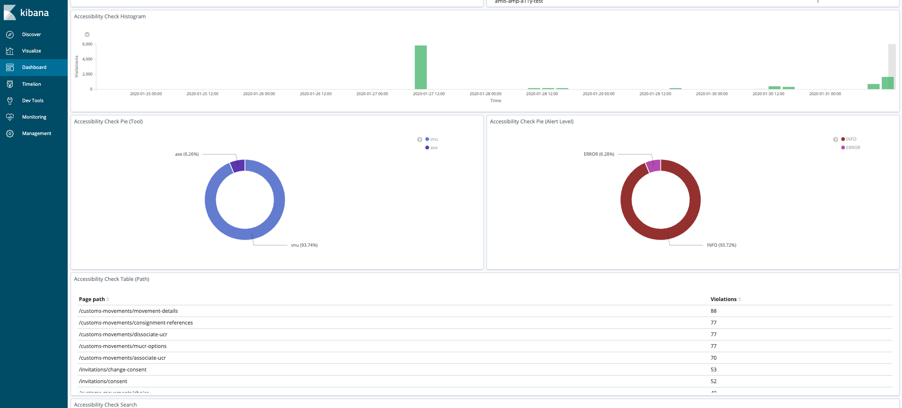

# Stage three: Continuous Integration tools

Once your service is deployed to staging you’ll want to be running tests against it. We have the following available which you can use.

## `AccessibilityTestJobBuilder`

The job builder captures and archives all HTML pages that your UI tests visit. These pages are then uploaded to a new sidecar container of our Jenkins build slave, named `accessibility-assessment`, and assessed during a post build task. If you currently maintain a UI smoke test that visits each page of your frontend, then running that test suite with this job builder will generate an output for you to review in Kibana (screenshot below). A link to this dashboard is available in the description of the job in Jenkins.

### The tools are tuned for HMRC Digital front-ends

The tools used in the assessment have been restricted to surface violations and errors raised on the contents of the `<main>` tag in each HTML page. In addition, it suppresses known violations and errors that we consider unimportant at HMRC, and in some cases, provide further information (links to GitHub issues or design system components) against violations and errors that originate in shared components like the GOV.UK templates.

### Upgrades and improvements do not require action from delivery teams

One of the benefits to implementing this as a component of the build and not as a library that test suite consumes, is the low cost of adoption. Furthermore, as we roll out improvements they will be available to everyone making use of the job builder. Features like improved reporting, axe/validator upgrades or even the addition of a new tool will not require effort from delivery teams.
